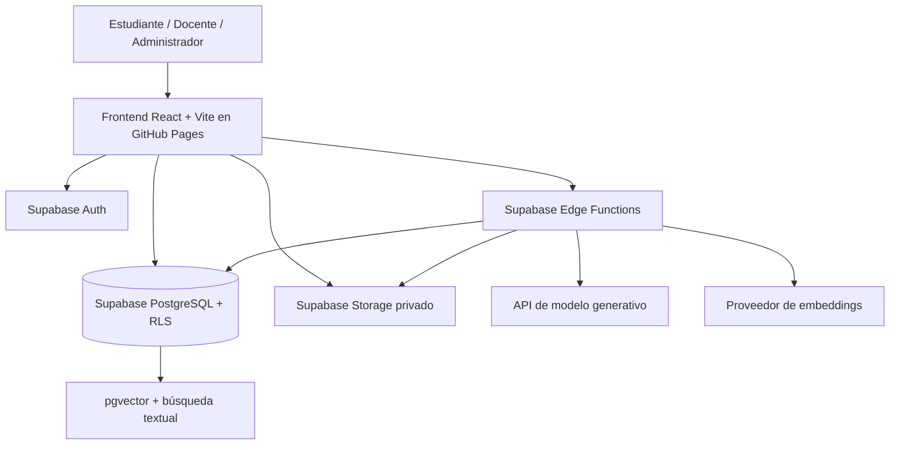
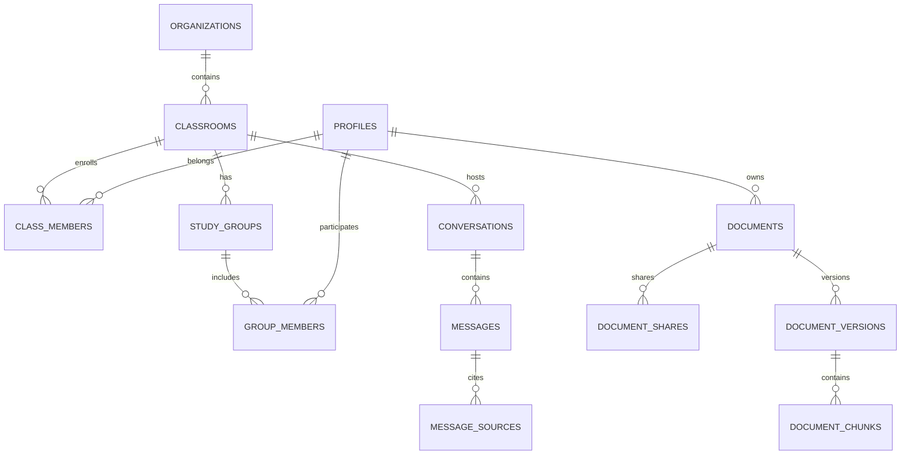
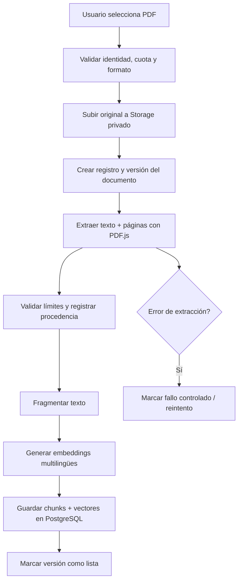
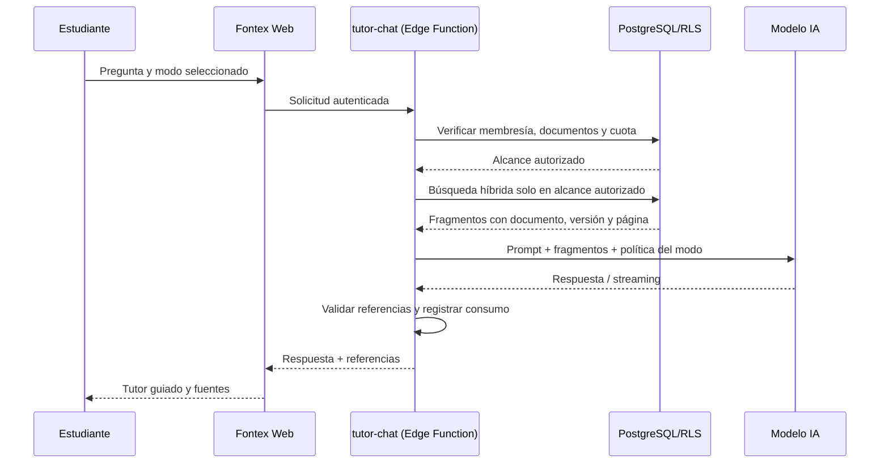

# Fontex — Plan maestro de desarrollo y arquitectura escalable

**Versión:** 1.0 — propuesta técnica inicial
**Fecha:** 8 de octubre de 2026
**Estado:** Planificación; arquitectura propuesta, no implementación existente
**Enfoque:** Prototipo académico universitario de primeros ciclos, con proyección multiinstitucional

> **Principio rector:** desarrollar una plataforma educativa web que no se limite a responder preguntas, sino que promueva el aprendizaje autónomo y guiado mediante IA, materiales autorizados y colaboración segura entre estudiantes.

---

## 1. Resumen ejecutivo

**Fontex** será un entorno virtual de aprendizaje colaborativo dirigido inicialmente a un salón universitario de primeros ciclos. Permitirá a estudiantes y docentes organizar documentos académicos, compartir materiales con grupos de estudio y consultar un tutor de IA sobre fuentes documentales autorizadas.

El nombre une **FONT**es —del latín, fuentes o manantial de información— y **TEX**tus —texto y contexto—. Su significado, **fuentes puestas en contexto**, resume el principio del motor RAG: ningún fragmento responde de forma aislada ni se presenta como conocimiento sin respaldo; las respuestas se fundamentan en el contexto recuperado de fuentes autorizadas y conservan referencias verificables.

La primera versión será una **aplicación web responsive** (potencialmente PWA) alojada en **GitHub Pages**. Utilizará **Supabase** para autenticación, base de datos PostgreSQL, políticas de seguridad a nivel de fila (RLS), almacenamiento privado y búsqueda vectorial con `pgvector`. Las operaciones que involucren claves privadas, recuperación autorizada y llamadas al modelo se realizarán en **Supabase Edge Functions**. El tutor conversacional utilizará una API de modelos reemplazable.

**Objetivo pedagógico:** fortalecer el aprendizaje autónomo, la comprensión de contenidos y el uso crítico de herramientas digitales.

**Alcance del piloto:** una institución, un docente, un aula, alrededor de 20–30 estudiantes y varios grupos de trabajo. El diseño de datos permitirá añadir nuevas aulas e instituciones posteriormente, sin construir funciones empresariales desde el inicio.

### 1.1. Decisiones ya propuestas

| Decisión | Elección inicial | Justificación |
|---|---|---|
| Experiencia | Web responsive, compatible con móvil | Evita mantener APK y tiendas de aplicaciones |
| Interfaz | React + Vite + TypeScript | Genera sitio estático publicable en GitHub Pages |
| Componentes UI | Tailwind CSS + shadcn/ui | Interfaz modular personalizable |
| Experiencia de chat | assistant-ui, previa prueba de integración | Evita reimplementar componentes conversacionales |
| Identidad y datos | Supabase Auth + PostgreSQL | Servicio administrado y RLS |
| Archivos | Supabase Storage privado | Control de acceso por usuario, aula y grupo |
| Recuperación | PostgreSQL + pgvector + búsqueda textual | RAG sin base vectorial adicional en el MVP |
| Lógica segura | Supabase Edge Functions (TypeScript/Deno) | Oculta claves y aplica reglas del servidor |
| PDFs | PDF.js para visualizar y extraer texto seleccionable | Reduce complejidad inicial; OCR posterior |
| LLM | API configurable | Evita dependencia directa de un proveedor |
| Embeddings | Modelo multilingüe evaluado en español | Prioriza recuperación en lengua del piloto |
| Despliegue | GitHub Actions → GitHub Pages | Integración y publicación reproducibles |
| Organización de código | Monolito modular | Escala funcionalmente sin microservicios prematuros |

**Criterio para escoger tecnología:** primero se construye la mínima solución segura y comprobable; solo se agrega infraestructura cuando una limitación medida lo exija.

---

## 2. Problema educativo y propuesta de valor

### 2.1. Problema a diagnosticar

En estudiantes de primeros ciclos pueden observarse dificultades para estudiar autónomamente, comprender materiales académicos, organizar recursos, acceder a retroalimentación y evaluar críticamente información generada por IA. Estas dificultades deben **comprobarse mediante un diagnóstico**, no presentarse como resultados ya medidos.

### 2.2. Solución

Fontex ofrecerá:

1. **Biblioteca privada:** cada estudiante administra sus documentos.
2. **Biblioteca grupal:** se comparten materiales explícitamente con miembros del grupo.
3. **Biblioteca del aula:** el docente publica materiales disponibles para estudiantes matriculados.
4. **Tutor con RAG:** responde utilizando documentos recuperados de acuerdo con permisos.
5. **Modos de respuesta:** estricto, comparativo y tutoría guiada.
6. **Historial diferenciado:** conversaciones privadas y, después, grupales.
7. **Actividades educativas:** ejercicios, pistas y retroalimentación básica.
8. **Evaluación del piloto:** resultados de aprendizaje, usabilidad y calidad de respuestas.

### 2.3. Objetivo general

Implementar un entorno virtual de aprendizaje colaborativo basado en inteligencia artificial que contribuya al aprendizaje autónomo de estudiantes universitarios de primeros ciclos mediante consultas documentales autorizadas y tutoría académica guiada.

### 2.4. Objetivos específicos

1. Diagnosticar necesidades de aprendizaje autónomo y uso de TIC del grupo participante.
2. Diseñar la arquitectura de un aula virtual con bibliotecas privadas y compartidas.
3. Implementar un tutor de IA que consulte fuentes autorizadas y ofrezca acompañamiento pedagógico.
4. Verificar la seguridad, usabilidad y calidad de la recuperación documental.
5. Evaluar los cambios observados en el aprendizaje y la experiencia de los estudiantes durante un piloto.

---

## 3. Reutilización de software libre y repositorios públicos

**Estrategia:** repositorio propio; incorporar bibliotecas concretas y adaptar patrones, no fusionar indiscriminadamente aplicaciones completas. Toda reutilización literal requiere verificar la licencia vigente y conservar avisos exigidos.

| Proyecto público | URL | Uso previsto | Qué **no** se incorporará inicialmente |
|---|---|---|---|
| **assistant-ui** | https://github.com/assistant-ui/assistant-ui | Componentes React de conversación, entrada de mensajes, streaming y experiencia del asistente (tras prueba de compatibilidad) | Su infraestructura de backend, si alguna integración la requiere |
| **shadcn/ui** | https://github.com/shadcn-ui/ui | Formularios, diálogos, navegación, tablas, indicadores y accesibilidad | Pantallas completas que no respondan al diseño propio |
| **Mozilla PDF.js** | https://github.com/mozilla/pdf.js | Visualización PDF y extracción de texto con referencia a página | OCR avanzado y funciones no necesarias del visor |
| **Chatbot UI** | https://github.com/mckaywrigley/chatbot-ui | Referencia de UX del chat, gestión de conversaciones y patrones visuales | Backend Next.js y migración íntegra del proyecto |
| **Supabase ChatGPT Your Files** | https://github.com/supabase-community/chatgpt-your-files | Referencia de arquitectura de ingesta, embeddings, RAG, consulta y seguridad | Copiar código sin revisión de licencia ni acoplar su esquema completo |
| **Supabase Vercel AI Chatbot** | https://github.com/supabase-community/vercel-ai-chatbot | Referencia de patrones de persistencia/streaming y organización de chat | Server Actions, rutas Next.js y dependencias innecesarias |
| **DocsGPT** | https://github.com/arc53/DocsGPT | Referencia funcional: fuentes, experiencia RAG, agentes y equipos | Su backend Python, Redis, Celery y despliegue multiproceso |

### 3.1. Política de incorporación

Antes de importar código o instalar dependencias:

- Comprobar la licencia **en la versión/commit preciso** a utilizar y las obligaciones de terceros.
- Distinguir **usar una idea/patrón** de **copiar código**.
- Evaluar compatibilidad con Vite y build estático.
- Evitar introducir servidores Next.js/Python solo para aprovechar una vista.
- Registrar dependencias, versiones fijadas, licencia, origen y finalidad en `docs/decisions/DEPENDENCIES.md`.
- Mantener actualizaciones de seguridad y revisar dependencias transitivas.

**Primera opción real de implementación:** `assistant-ui` + `shadcn/ui` + PDF.js + módulos propios. Los demás repositorios son fuentes de consulta técnica, salvo que una auditoría justifique extraer una pieza específica.

---

## 4. Arquitectura de alto nivel



### 4.1. Responsabilidades por capa

**Frontend — GitHub Pages**

- Vistas, navegación y formularios.
- Autenticación mediante SDK de Supabase.
- Carga de PDFs usando políticas adecuadas.
- Visualización de documentos con PDF.js.
- Extracción inicial de texto de PDFs seleccionables.
- Chat y manejo de streaming.
- No contiene claves secretas ni puede decidir qué documentos son accesibles.

**Base de datos — Supabase PostgreSQL**

- Usuarios, membresías, roles, aulas, grupos y documentos.
- Registro de ingesta, mensajes, referencias y cuotas.
- Embeddings asociados a fragmentos.
- Políticas RLS para impedir lectura cruzada entre grupos/instituciones.

**Storage — Supabase**

- Buckets privados, nunca listado público de documentos académicos.
- Rutas no adivinables y permisos basados en propietarios y recursos compartidos.
- URLs firmadas temporales cuando corresponda.

**Edge Functions**

- Validar usuario, cuotas y autorización del recurso.
- Coordinar ingesta, embeddings y búsqueda autorizada.
- Consultar la API de IA sin exponer credenciales.
- Entregar respuesta y metadatos de referencias.
- Registrar uso agregado y errores mínimos.

**Proveedor de IA**

- Generar explicaciones y tutoría guiada.
- Generar embeddings con un modelo multilingüe.
- Ser sustituible mediante adaptadores definidos en el código.

### 4.2. Restricciones de GitHub Pages

GitHub Pages sirve **archivos estáticos**. Puede servir un frontend React compilado, pero no ejecutar endpoints del lado del servidor, procesadores Python ni claves confidenciales.

Consideraciones:

- Configurar `base` de Vite según el nombre/ruta del repositorio.
- Utilizar `HashRouter` en el MVP o un diseño documentado de rutas compatible con hosting estático.
- Registrar en Supabase las URL de redirección de autenticación y los orígenes permitidos.
- Compilar y publicar la carpeta `dist/` con GitHub Actions.
- No almacenar la `service_role` ni las claves de LLM en el frontend; la clave pública/anon de Supabase es utilizable **solo junto con RLS correcto**.

### 4.3. Restricciones de Supabase Free

Las cuotas, precios y límites operativos deben **verificarse al momento del despliegue**, porque pueden modificarse. El MVP no dependerá de una cuota implícitamente ilimitada.

- Establecer límites de subida y retención.
- Monitorizar almacenamiento físico y tamaño del índice vectorial.
- Registrar invocaciones y latencias de funciones.
- Considerar pausas por inactividad del plan gratuito.
- Evitar procesamiento pesado y OCR dentro de solicitudes síncronas.
- Presupuestar el consumo del modelo generativo y embeddings por separado.

---

## 5. Organización del repositorio

```text
fontex/
├── src/
│   ├── app/
│   │   ├── router/
│   │   ├── layouts/
│   │   └── providers/
│   ├── features/
│   │   ├── auth/
│   │   ├── classrooms/
│   │   ├── groups/
│   │   ├── library/
│   │   ├── tutor/
│   │   ├── conversations/
│   │   ├── activities/
│   │   └── administration/
│   ├── components/
│   │   ├── ui/
│   │   ├── navigation/
│   │   └── feedback/
│   ├── lib/
│   │   ├── supabase/
│   │   ├── pdf/
│   │   └── validation/
│   └── styles/
├── supabase/
│   ├── migrations/
│   ├── functions/
│   │   ├── document-ingest/
│   │   ├── document-process/
│   │   ├── tutor-chat/
│   │   ├── tutor-feedback/
│   │   └── _shared/
│   │       ├── auth/
│   │       ├── rag/
│   │       ├── providers/
│   │       └── prompts/
│   └── tests/
├── tests/
│   ├── unit/
│   ├── integration/
│   ├── security/
│   └── e2e/
├── docs/
│   ├── architecture/
│   ├── database/
│   ├── pedagogical-design/
│   └── decisions/
├── .github/workflows/
│   ├── ci.yml
│   └── deploy-pages.yml
└── README.md
```

**Regla de diseño:** mantener módulos por funcionalidad y adaptadores por proveedor; evitar referencias circulares y dependencias directas de la UI con políticas de datos.

---

## 6. Modelo de datos preliminar

### 6.1. Entidades propuestas

| Tabla | Propósito | Campos relevantes sugeridos |
|---|---|---|
| `organizations` | Instituciones | `id`, `name`, `status` |
| `profiles` | Perfiles de `auth.users` | `id`, `display_name`, `created_at` |
| `classrooms` | Aula/curso | `id`, `organization_id`, `title`, `owner_id`, `term` |
| `class_members` | Matrícula y roles de aula | `classroom_id`, `user_id`, `role`, `status` |
| `study_groups` | Grupos por aula | `id`, `classroom_id`, `name` |
| `group_members` | Pertenencia a grupo | `group_id`, `user_id`, `status` |
| `documents` | Metadatos del documento | `id`, `owner_id`, `classroom_id`, `storage_path`, `state`, `current_version_id` |
| `document_versions` | Versionado | `id`, `document_id`, `sha256`, `version`, `uploaded_at` |
| `document_shares` | Recursos compartidos | `document_id`, `scope_type`, `scope_id`, `granted_by` |
| `document_chunks` | Fragmentos recuperables | `id`, `document_version_id`, `page`, `content`, `embedding`, `embedding_model` |
| `ingestion_jobs` | Trabajo de procesamiento | `id`, `document_version_id`, `state`, `attempts`, `last_error_code` |
| `conversations` | Chats personales/grupales | `id`, `owner_id`, `classroom_id`, `scope_type`, `group_id`, `mode` |
| `messages` | Turnos de chat | `id`, `conversation_id`, `author_id`, `role`, `content`, `created_at` |
| `message_sources` | Referencias comprobables | `message_id`, `document_chunk_id`, `document_version_id`, `page` |
| `learning_activities` | Actividades | `id`, `classroom_id`, `title`, `rubric` |
| `learning_attempts` | Intentos | `id`, `activity_id`, `student_id`, `result`, `feedback` |
| `usage_events` | Consumo/cuotas | `user_id`, `event_type`, `quantity`, `occurred_at` |

> **Nota de seguridad:** el esquema anterior es conceptual. Las llaves foráneas, índices, checks, restricciones de roles y políticas RLS definitivas deben diseñarse y probarse antes de uso real.

### 6.2. Relaciones de alto nivel



### 6.3. Reglas de acceso

- Los documentos personales son visibles solo para el propietario, salvo compartición explícita.
- Los materiales de grupo requieren membresía vigente del grupo y del aula.
- Los materiales del aula requieren matrícula vigente, con privilegios adicionales para docentes autorizados.
- Las conversaciones privadas solo pertenecen al usuario, incluso cuando usen documentos grupales.
- Las conversaciones grupales, si se habilitan, son visibles únicamente para miembros autorizados.
- Los docentes ven métricas educativas agregadas; **no** leen automáticamente chats privados.
- Quitar un documento compartido debe impedir **futuras recuperaciones** del documento; la política sobre contenido ya incorporado en historiales debe definirse expresamente.
- Las membresías no pueden ser asignadas unilateralmente por un estudiante desde el cliente.

### 6.4. Seguridad por diseño

1. Habilitar RLS en **todas** las tablas expuestas por la API.
2. Probar explícitamente políticas sobre `documents`, `document_chunks`, `conversations`, `messages` y `storage.objects`.
3. Evitar funciones SQL `SECURITY DEFINER` salvo necesidad justificada, con privilegios mínimos y control explícito de ejecución.
4. Filtrar documentos autorizados **antes** de construir el contexto enviado al LLM.
5. No utilizar la clave `service_role` como identidad general en solicitudes de usuarios.
6. Validar los permisos también en Edge Functions, no solo en la interfaz.
7. Aplicar límites por usuario para evitar consumo no autorizado de IA.
8. Revisar vías indirectas de filtración: vectores, RPC, metadatos, enlaces firmados, cachés, logs, historial y streaming.

---

## 7. Arquitectura documental e ingesta

### 7.1. Flujo del documento



Para el MVP, el navegador puede extraer texto seleccionable y asociarlo a páginas. **El texto extraído por un cliente no es una prueba íntegra del contenido del PDF original**: un usuario malicioso puede alterarlo. Se debe registrar la procedencia de la extracción y, para materiales oficiales o etapas posteriores, validar/reprocesar del lado del servidor.

### 7.2. Estados y robustez

Estados orientativos:

- `uploaded` — archivo recibido.
- `processing` — pendiente o en procesamiento.
- `ready` — documento consultable.
- `failed` — procesamiento fallido, con error controlado.
- `deleted` — baja lógica y limpieza pendiente/completada.

La ingesta será **idempotente**: los reintentos no duplicarán chunks. Se calculará un hash por versión, se almacenará el modelo de embedding y se posibilitará reindexación cuando cambie el modelo.

### 7.3. Límites sugeridos del MVP

| Restricción | Propuesta inicial |
|---|---|
| Tipo | PDF con texto seleccionable |
| Tamaño | Hasta 5 MB por PDF |
| Páginas | Hasta 100, sujeto a límite de texto |
| Archivos por usuario | Cuota configurable |
| Archivos por grupo | Cuota configurable |
| OCR de PDFs escaneados | No incluido inicialmente |
| Word/PowerPoint | Fase posterior |
| Duplicados | Comparación mediante hash |
| Eliminación | Debe borrar/invalidar original, chunks y accesos según política de retención |

**Límite operativo:** la extracción o indexación muy pesada no debe ejecutarse sin control en una Edge Function síncrona. Si los límites gratuitos son insuficientes, introducir una cola/worker especializado en la fase siguiente.

---

## 8. Motor RAG y experiencia tutorial

### 8.1. Flujo de consulta



### 8.2. Recuperación de información

Se combinarán:

- **Búsqueda semántica:** similitud entre embedding de la pregunta y los fragmentos.
- **Búsqueda textual:** coincidencias de nombres, conceptos, términos y títulos.
- **Filtrado por permisos:** documentos accesibles al estudiante y al contexto de la conversación.
- **Clasificación/reordenación:** si las pruebas muestran necesidad, aplicar un reranker.
- **Citas verificadas:** solo devolver referencias a fragmentos realmente recuperados, con versión y página conservadas.

Cada fragmento debe llevar metadatos de documento, versión, número de página y posición. Si un material no contiene numeración de página fiable, señalar esa limitación y no inventarla.

### 8.3. Modos del tutor

| Modo | Comportamiento | Reglas |
|---|---|---|
| **Estricto** | Basar respuestas en fuentes recuperadas y autorizadas | Si no hay evidencia suficiente, declararlo; no fabricar citas |
| **Comparativo** | Permitir explicaciones generales del LLM además de fuentes | Requiere selección/autorización explícita; separar lo documental de lo externo |
| **Guiado** | Favorecer preguntas, pistas y ejercicios en lugar de responder de inmediato | Es una capa pedagógica combinable con estricto/comparativo |

**Precisión conceptual:** los embeddings documentales almacenados en `pgvector` **no** son los embeddings internos del modelo generativo. Tampoco es posible garantizar mediante un `system prompt` que el LLM nunca utilice conocimientos de entrenamiento. Se mitigará con control de recuperación, instrucciones, validaciones y pruebas de fundamentación.

### 8.4. Contratos de proveedores

```ts
interface LLMProvider {
  generate(input: TutorRequest): Promise<TutorResponse>;
  stream(input: TutorRequest): AsyncIterable<TutorEvent>;
}

interface EmbeddingProvider {
  embed(texts: string[]): Promise<number[][]>;
  getModelInfo(): {
    id: string;
    dimensions: number;
  };
}
```

Estas interfaces son **pseudocontratos**: los tipos `TutorRequest`, `TutorResponse` y `TutorEvent` se definirán durante implementación.

**Regla de versionado:** cambiar de modelo de embeddings o dimensionalidad exige crear/reindexar el índice compatible; los vectores de modelos distintos no deben mezclarse en búsquedas de similitud sin diseño explícito.

### 8.5. Controles contra alucinaciones e instrucciones maliciosas

- Tratar los PDFs como **datos no confiables**, nunca como instrucciones del sistema.
- Rechazar o ignorar órdenes maliciosas encontradas dentro de documentos.
- No permitir que una cita se invente como texto libre: construir/verificar la referencia desde IDs de chunks recuperados.
- En modo estricto, responder «no hay evidencia suficiente en los materiales disponibles» cuando corresponda.
- No incorporar herramientas de búsqueda web sin una autorización separada.
- Medir precisión de citas, relevancia, abstención y resistencia a ataques de prompt injection.

---

## 9. Diseño pedagógico

### 9.1. Interacción propuesta

**Antes de clase:** el estudiante revisa recursos cortos y señala dudas.

**Durante o después de clase:** conversa con su tutor usando diapositivas, separatas o artículos autorizados.

**Tutoría guiada:** el sistema explica, formula preguntas orientadoras y plantea ejercicios progresivos.

**Retroalimentación:** el estudiante resuelve una actividad y recibe comentarios descriptivos, no solo la respuesta correcta.

**Seguimiento:** se registran indicadores de participación y avance sin dar acceso innecesario al contenido privado de las conversaciones.

### 9.2. Evaluación académica

**Diseño inicial posible:** piloto preexperimental con pretest y postest durante cuatro semanas, con 20–30 estudiantes de un curso. Las comparaciones deben reconocer que un grupo único no permite atribuir con certeza los cambios a la plataforma.

| Dimensión | Instrumento/indicador |
|---|---|
| Aprendizaje autónomo | Cuestionario previamente seleccionado/validado para el contexto |
| Comprensión académica | Prueba antes y después de la intervención |
| Participación | Actividades completadas y frecuencia de uso |
| Usabilidad | Encuesta breve + tareas observadas |
| Calidad de IA | Conjunto de preguntas con evidencia esperada y evaluación docente |
| Seguridad | Matriz de pruebas de autorización |

Variables de análisis recomendadas: diferencias pre/post, tasa de uso, dificultades recurrentes, calidad de citas, porcentaje de abstenciones correctas y percepción de utilidad. **No inventar porcentajes de mejora antes de hacer el piloto.**

---

## 10. UX/UI de Fontex

### 10.1. Navegación del estudiante

- **Inicio:** resumen del aula y últimas actividades.
- **Mis archivos:** biblioteca personal.
- **Mi grupo:** archivos compartidos y miembros autorizados.
- **Materiales del curso:** publicaciones del docente.
- **Tutor IA:** elección de contexto y modalidad, chat e historial.
- **Mi progreso:** actividades y retroalimentación básica (tras el MVP núcleo).

### 10.2. Navegación del docente

- Administración de aula y matrícula.
- Creación/asignación de grupos.
- Publicación de materiales del curso.
- Supervisión de cuotas y estados de procesamiento.
- Vista agregada de actividades y resultados autorizados.

### 10.3. Criterios de UX

- **Mobile-first:** menús accesibles en pantallas reducidas.
- **Estados claros:** subida, indexación, error y reintento.
- **Fuentes comprensibles:** título, versión y página enlazable cuando corresponda.
- **Privacidad visible:** cada archivo muestra si es privado, del grupo o del aula.
- **Permisos explícitos:** la compartición debe ser una acción consciente.
- **Accesibilidad:** teclado, foco visible, contraste, etiquetas y mensajes de error adecuados.
- **Tolerancia a fallos:** una pérdida de conexión no debe duplicar mensajes, archivos ni cobros.

---

## 11. API, operaciones y límites

### 11.1. Operaciones previstas

| Operación | Implementación | Protección |
|---|---|---|
| Iniciar sesión | Supabase Auth | Sesión autenticada |
| Listar aulas/grupos | Consultas DB con RLS | Matrícula vigente |
| Subir PDF | Storage privado + metadatos DB | Cuota, rol, tipo, tamaño |
| Compartir PDF | Operación DB validada | Propietario o rol autorizado |
| Procesar documento | Edge Function o flujo de ingesta | Versión, idempotencia, permisos |
| Preguntar al tutor | `tutor-chat` | Usuario, cuota, fuentes permitidas |
| Guardar conversación | DB con RLS | Propietario/membresía |
| Ver referencias | DB/Storage | Permisos del documento actual |
| Gestionar grupos | Operación protegida | Docente/admin del aula |

### 11.2. Política mínima de cuotas

- Consultas diarias máximas por estudiante configurables.
- Tokens máximos por solicitud y por sesión.
- Número máximo de documentos seleccionados en una consulta.
- Número máximo de fragmentos recuperados.
- Límite de archivos/almacenamiento por aula y grupo.
- Presupuesto mensual de API con alertas y bloqueo.
- Límite de concurrencia y prevención de reintentos duplicados.

**No** confiar en límites impuestos únicamente en el navegador: deben validarse de forma atómica en backend/base de datos.

---

## 12. Seguridad, privacidad y cumplimiento

### 12.1. Amenazas a contemplar

| Amenaza | Mitigación prioritaria |
|---|---|
| Estudiante lee documentos de otro grupo | RLS, consultas autorizadas y pruebas de acceso directo |
| Acceso a fragmentos/embeddings ajenos | RLS y control de funciones RPC/vectoriales |
| Robo de clave API | Claves solo en secretos del servidor; rotación |
| Subida maliciosa de PDF | Validación de formato, límites y aislamiento de extracción |
| Prompt injection documental | Separación datos/instrucciones; pruebas adversariales |
| Docente lee chats privados sin autorización | RLS y políticas claras de visibilidad |
| Exceso de gasto por API | Cuotas transaccionales y presupuestos máximos |
| Filtración por URLs firmadas | Caducidad, mínima duración y permisos previos |
| Eliminación incompleta | Política de retención, limpieza de chunks, archivos y logs asociados |
| Datos externos enviados a LLM | Información y consentimiento/base legal aplicable; minimización |

### 12.2. Privacidad académica

- Informar qué datos se recopilan, finalidad, destinatarios y tiempo de retención.
- Usar consentimiento y otras bases jurídicas según normas aplicables; revisar requisitos institucionales y protección de datos personales en Perú antes del piloto.
- Evitar que los documentos de los estudiantes se utilicen como entrenamiento por terceros sin la configuración/acuerdo adecuado.
- Permitir eliminar archivos y solicitar eliminación de datos según política aplicable.
- No almacenar mensajes completos en logs de diagnóstico por defecto.
- Minimizar datos enviados a proveedores externos.
- No utilizar los chats privados para calificar a estudiantes sin una justificación y transparencia explícitas.

---

## 13. CI/CD, entornos y calidad

### 13.1. Entornos

1. **Local:** variables en `.env.local`, Supabase local o instancia de desarrollo.
2. **Staging:** proyecto Supabase separado si los recursos lo permiten; datos ficticios.
3. **Producción piloto:** instancia del aula real y frontend de GitHub Pages.

### 13.2. Pipeline GitHub Actions

En cada PR:

1. Instalar dependencias con lockfile.
2. Ejecutar lint y comprobación de tipos.
3. Ejecutar pruebas unitarias e integración que no requieran credenciales privadas.
4. Compilar el frontend Vite.
5. Ejecutar comprobación básica de dependencias/licencias según política.

En `main` y tras pasar las validaciones:

1. Compilar `dist/` con `base` correcto.
2. Publicar en GitHub Pages.
3. Ejecutar prueba de disponibilidad y rutas estáticas si es viable.

**Migraciones:** nunca ejecutar cambios destructivos automáticamente sobre producción sin revisión, respaldo y plan de reversión.

### 13.3. Pruebas de seguridad imprescindibles

- Usuario A no puede consultar documento de usuario B.
- Grupo A no puede ver PDFs, chunks ni conversaciones del grupo B.
- Conocer el UUID de un recurso no permite consultarlo.
- Revocar membresía elimina acceso futuro.
- Las referencias del chat no filtran el contenido de documentos sin permiso.
- Storage y enlaces firmados obedecen la política.
- Un usuario normal no puede asignarse rol docente/admin.
- Una llamada manipulada al endpoint de IA no elude cuotas ni modos permitidos.

---

## 14. Roadmap ejecutable para Codex

### Bloque 0 — Fundación técnica

**Tareas**

- Crear repo `fontex` con Vite + React + TypeScript.
- Añadir Tailwind, shadcn/ui y evaluar integración de assistant-ui.
- Configurar routing estático, estructura modular y diseño base mobile-first.
- Configurar ESLint, TypeScript estricto y pruebas unitarias.
- Crear GitHub Actions para CI y Pages.
- Escribir `README.md`, documento de arquitectura y registro de licencias.

**Aceptación**

- `npm run build`, lint, typecheck y pruebas básicas pasan.
- La aplicación abre desde GitHub Pages y recarga sus rutas sin error.
- No se publican secretos ni configuración privada.

### Bloque 1 — Identidad, aulas y grupos

**Tareas**

- Crear esquema inicial y migraciones.
- Integrar Supabase Auth y perfiles.
- Implementar aula, matrícula por invitación, roles y grupos.
- Configurar RLS en todas las tablas correspondientes.
- Crear pruebas de seguridad con múltiples usuarios ficticios.

**Aceptación**

- Un estudiante no puede autoasignarse privilegios.
- Un usuario ajeno no puede ver el aula ni los grupos privados.
- La asignación y remoción de grupo funciona y se verifica con consultas directas.

### Bloque 2 — Biblioteca documental

**Tareas**

- Bucket privado y reglas de Storage.
- Subida/listado/descarga/eliminación de PDF.
- Documentos personales, grupales y de aula mediante permisos.
- Visor PDF.js y estados de subida.
- Cuotas y control de duplicados.

**Aceptación**

- Los archivos no se pueden descargar por usuarios no autorizados.
- Compartir o dejar de compartir modifica los accesos efectivos.
- Errores y límites se muestran correctamente.

### Bloque 3 — Indexación y RAG

**Tareas**

- Extraer texto y páginas de PDFs seleccionables.
- Crear fragmentos con identificadores de documento y versión.
- Generar embeddings con proveedor multilingüe.
- Almacenar vectores en PostgreSQL/pgvector.
- Implementar recuperación híbrida con permisos.
- Crear conjunto pequeño de preguntas en español con respuestas esperadas.

**Aceptación**

- No se recuperan fragmentos no autorizados.
- Las referencias indican documento y página correctos cuando corresponde.
- Los documentos fallidos no quedan marcados como listos.
- Reintentar una ingesta no genera duplicados.

### Bloque 4 — Tutor académico

**Tareas**

- Integrar assistant-ui y endpoint `tutor-chat`.
- Añadir historial y selección de contexto documental.
- Modo estricto y comparativo con consentimiento/selección explícita.
- Modo guiado superponible, pistas, preguntas y práctica básica.
- Guardar fuentes vinculadas a respuestas.
- Cuotas de tokens y llamadas.

**Aceptación**

- Modo estricto reconoce falta de evidencia y evita citas inventadas.
- Modo comparativo distingue información externa de la documental.
- Una conversación privada no aparece en otra cuenta.
- Claves de IA permanecen fuera del frontend.

### Bloque 5 — Robustez, accesibilidad y seguridad

**Tareas**

- Pruebas E2E en navegador y móvil.
- Auditoría RLS de cada tabla, RPC y Storage.
- Ensayos de prompt injection desde documentos.
- Pruebas de concurrencia, errores y reintentos.
- Medición de latencia, costo por consulta y uso de almacenamiento.
- Ajustes de accesibilidad.

**Aceptación**

- Cero defectos críticos abiertos de autorización.
- Resultados documentados con casos reproducibles.
- Interfaz funcional en tamaño móvil y escritorio.

### Bloque 6 — Piloto educativo

**Tareas**

- Obtener autorizaciones institucionales y consentimiento aplicable.
- Aplicar diagnóstico y pretest.
- Capacitar a docente y estudiantes.
- Aplicar la intervención durante el periodo definido.
- Realizar postest, encuesta y análisis de calidad del tutor.
- Documentar hallazgos y limitaciones.

**Aceptación**

- Informe técnico y pedagógico reproducible.
- Resultados interpretados sin afirmar causalidad que el diseño no sustente.
- Recomendaciones priorizadas para la siguiente versión.

---

## 15. Estrategia de crecimiento a largo plazo

| Etapa | Público | Evolución | Cambios posibles de infraestructura |
|---|---|---|---|
| **A. MVP** | 1 aula, ~30 estudiantes | PDFs y tutor, privacidad/grupos | GitHub Pages + Supabase Free + API IA controlada |
| **B. Departamental** | Varias aulas/docentes | Gestión de cursos, cuotas y analítica | Escalar recursos Supabase y optimizar índices |
| **C. Institucional** | Varias facultades/instituciones | Multi-tenancy, roles administrativos, auditoría | Workers de ingesta, colas, respaldo y monitoreo |
| **D. Plataforma ampliada** | Muchas instituciones | Integraciones LMS, IA adaptativa, PWA robusta/app | CDN, servicios dedicados donde existan cuellos medidos |

### 15.1. Elementos preparados desde hoy para escalar

- Identificadores UUID y relaciones explícitas.
- `organization_id` en la jerarquía de aulas y políticas correspondientes.
- Versionado de documentos y embeddings.
- Capas `LLMProvider` y `EmbeddingProvider` sustituibles.
- Migraciones de datos versionadas.
- Ingesta reintentable e idempotente.
- Telemetría de costo y rendimiento.
- Pruebas de aislamiento automatizadas.

### 15.2. Elementos que NO se implementarán todavía

- Microservicios y Kubernetes.
- Procesamiento OCR de alta escala.
- Integraciones LMS/LTI completas.
- Cobranza y suscripciones.
- Aplicaciones Android/iOS nativas.
- Sistema de agentes autónomos complejos.
- Analítica predictiva o calificaciones automáticas de alto impacto.

---

## 16. Riesgos, alternativas y mitigaciones

| Riesgo | Probabilidad/impacto estimativo | Respuesta |
|---|---|---|
| Componentes de chat incompatibles con Vite | Media / Media | Spike técnico en Bloque 0; fallback a componentes propios ligeros |
| Limits de Edge Functions para PDFs | Media / Alta | Procesamiento ligero, límites de tamaño, worker futuro |
| Mala recuperación semántica en español | Media / Alta | Benchmark de embeddings multilingües y búsqueda híbrida |
| Exposición de datos entre grupos | Baja-media / Crítica | RLS, pruebas negativas, revisión de RPC y storage |
| Costos de LLM inesperados | Media / Alta | Cuotas y presupuesto máximo, medición por usuario |
| Citas erróneas o respuestas inventadas | Alta / Alta | Validación de referencias y evaluación docente |
| Migración del modelo de embeddings | Media / Media | Versionar y reindexar por lotes |
| Dependencia de una licencia/repositorio | Media / Media | Auditoría temprana y bibliotecas reemplazables |
| Proyecto se vuelve demasiado grande | Alta / Alta | Alcance MVP y cierre por bloques |
| Evaluación educativa sin evidencia sólida | Media / Alta | Diseño de instrumentos, pre/post y reconocer limitaciones |

---

## 17. Indicadores técnicos y criterios de éxito

**No fijar cifras de rendimiento como hechos antes de medirlas.** Registrar métricas basales y establecer objetivos tras la prueba con datos reales.

Métricas técnicas:

- Tasa de subidas procesadas correctamente.
- Latencia de respuesta del tutor (p50/p95).
- Tiempo de indexación por tamaño de documento.
- Costo medio de tokens y embeddings por consulta.
- Almacenamiento ocupado por archivo e índice.
- Tasa de errores y reintentos.
- Número de vulnerabilidades de autorización detectadas/resueltas.

Métricas pedagógicas:

- Diferencia descriptiva entre pretest y postest.
- Frecuencia y tipo de consultas académicas.
- Proporción de ejercicios guiados completados.
- Utilidad percibida y facilidad de uso.
- Tasa de respuestas con evidencia suficiente.
- Exactitud de referencias documentales.

---

## 18. Orden de trabajo recomendado y regla para Codex

**Orden:** fundación técnica → identidad y RLS → biblioteca → ingesta y RAG → tutor → pruebas integrales → piloto.

**Nunca** implementar primero un chatbot conectado a todos los documentos y añadir después la seguridad. Los permisos son parte del modelo de datos y de la recuperación desde el comienzo.

### Plantilla de instrucción para Codex

> Lee primero `Fontex_Plan_Maestro_Arquitectura_v1.md` y audita el estado del repositorio. Implementa exclusivamente el bloque solicitado; no añadas funciones de etapas futuras salvo interfaces mínimas necesarias para evitar acoplamiento. Mantén el frontend compatible con un build estático para GitHub Pages y emplea Supabase para datos/autorización. No incluyas claves secretas en el cliente. Añade migraciones, documentación y pruebas de los permisos modificados. Antes de cerrar, ejecuta lint, typecheck, pruebas y build; comunica resultados reales, archivos cambiados, riesgos pendientes y qué falta para el siguiente bloque. No declares una función terminada si no se ha validado.

### Primera orden concreta: Bloque 0

> **Objetivo:** crear la estructura base de Fontex sin conectar todavía documentos privados ni una API de IA real.
>
> 1. Configura Vite, React y TypeScript estricto.
> 2. Añade Tailwind y shadcn/ui; incorpora únicamente los componentes necesarios para un shell responsivo.
> 3. Evalúa `assistant-ui` con una conversación simulada; si su integración exige servicios no compatibles con GitHub Pages, documenta la limitación y usa un adaptador o chat simple temporal.
> 4. Implementa páginas mínimas: inicio, aula, grupo, biblioteca, tutor y administración, con datos falsos claramente identificados.
> 5. Agrega navegación compatible con hosting estático.
> 6. Prepara `supabase/` para futuras migraciones y funciones, pero no inventes un esquema productivo sin revisión.
> 7. Configura GitHub Actions para CI y despliegue de `dist/` a GitHub Pages.
> 8. Crea `README.md`, `docs/architecture/overview.md` y `docs/decisions/DEPENDENCIES.md`.
> 9. Ejecuta lint, typecheck, tests y build; reporta los resultados reales.
>
> **Criterios de aceptación:** la aplicación compilada funciona en GitHub Pages, las rutas y navegación responden en móvil/escritorio, no hay secretos en el cliente y CI verifica lo esencial.

---

## 19. Decisiones abiertas que deben resolverse con pruebas

1. Seleccionar el modelo de embeddings más fiable para español a partir de un benchmark pequeño.
2. Escoger proveedor/modelo generativo según costo y desempeño pedagógico.
3. Determinar si `assistant-ui` encaja sin dependencias de servidor incompatibles.
4. Decidir la técnica definitiva de indexación cuando se midan los documentos reales.
5. Formalizar qué puede ver cada rol sobre mensajes privados, agregados y resultados.
6. Establecer política de eliminación y retención de documentos y chats.
7. Elegir instrumentos de medición académica adecuados al curso.
8. Definir presupuesto máximo del piloto y límites de uso correspondientes.

No son razones para detener la construcción del **Bloque 0**; se resolverán antes de los módulos afectados.

---

## 20. Referencias técnicas principales

- assistant-ui: <https://github.com/assistant-ui/assistant-ui>
- shadcn/ui: <https://github.com/shadcn-ui/ui>
- Mozilla PDF.js: <https://github.com/mozilla/pdf.js>
- DocsGPT: <https://github.com/arc53/DocsGPT>
- Chatbot UI: <https://github.com/mckaywrigley/chatbot-ui>
- Supabase ChatGPT Your Files: <https://github.com/supabase-community/chatgpt-your-files>
- Supabase Vercel AI Chatbot: <https://github.com/supabase-community/vercel-ai-chatbot>
- Supabase Docs: <https://supabase.com/docs>
- Supabase Vector Columns (`pgvector`): <https://supabase.com/docs/guides/ai/vector-columns>
- Supabase Row Level Security: <https://supabase.com/docs/guides/database/postgres/row-level-security>
- Supabase Edge Functions: <https://supabase.com/docs/guides/functions>
- GitHub Pages: <https://docs.github.com/en/pages>
- Vite Deploying a Static Site: <https://vite.dev/guide/static-deploy.html>

> **Advertencia:** los repositorios, licencias y cuotas de servicios pueden cambiar. Antes de incorporar código ajeno o desplegar producción, revisar la versión concreta y la documentación oficial correspondiente.

---

## 21. Conclusión

Para Fontex conviene construir **un frontend propio y modular**, reutilizar bibliotecas de interfaz y lectura PDF, inspirarse en sistemas RAG abiertos y utilizar Supabase como plataforma administrada. Así se conserva el control de las decisiones pedagógicas y de privacidad sin replicar toda la infraestructura de DocsGPT.

El éxito del prototipo no se medirá solo porque el chat funcione, sino porque:

1. Los estudiantes puedan estudiar sus fuentes y colaborar sin exponer datos ajenos.
2. El tutor proporcione explicaciones guiadas y referencias verificables.
3. La implementación pueda ser evaluada técnica y pedagógicamente.
4. La base permita incorporar nuevas aulas y docentes con cambios controlados.

**Próxima acción recomendada:** abrir el repositorio propio e implementar exclusivamente el **Bloque 0**.
